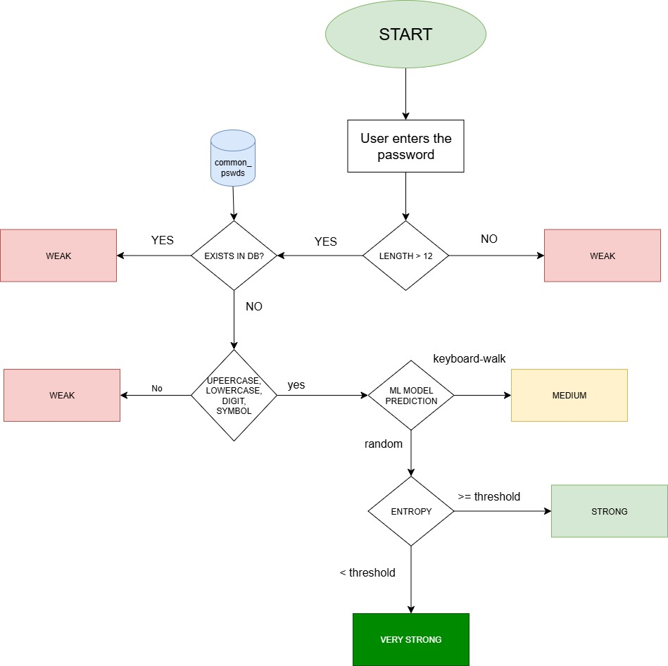

# 🔐 VulnPswdSniff

Welcome to **VulnPswdSniff**, an open-source Python tool for evaluating the strength of input passwords.

---

### 
 Security Aspects Analyzed

This tool checks for the following:

1. **Length** of the password  
2. **Existence** in a database of the 10,000 most common passwords  
3. Presence of **at least one**:
   - Uppercase letter  
   - Lowercase letter  
   - Digit  
   - Symbol  
4. **Classification** as a **Random** or **Keyboard-walk** password using a trained Random Forest model  
5. **Entropy calculation** of the password  

---

###  Password Strength Levels

Passwords are classified into one of four strength levels:  
**`["Weak", "Medium", "Strong", "Very Strong"]`**

---

###  Logic Structure

---

